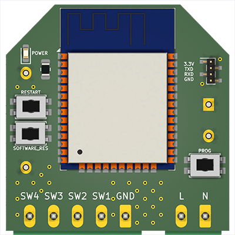
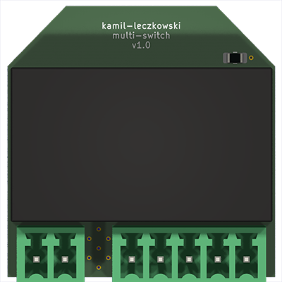

# Multi-Switch

## Overview

The Multi-Switch project is built on the ESPHome system and features a setup with four buttons. Each button triggers different events: `pressed_short`, `pressed_long`, `pressed_double`, and `idle` (when there is no interaction with the buttons). This project is compatible with the Shelly Wall Switch 4.

## GPIO Pin Configuration

- **GPIO32** - sw_1
- **GPIO33** - sw_2
- **GPIO25** - sw_3
- **GPIO26** - sw_4
- **GPIO27** - software_res (unused)

## Events

- **pressed_short**: Triggered by a short press of a button.
- **pressed_long**: Triggered by a long press of a button.
- **pressed_double**: Triggered by a double press of a button.
- **idle**: Triggered when there is no interaction with the buttons.

## Images

### Top View

### Bottom View

## Parts List

| Part                          | Quantity |
| ----------------------------- | -------- |
| ESP32 Chip                    | 1x       |
| SMD Touch Buttons 3\*4\*2.5mm | 3x       |
| 2EDG 3.81mm 5-pin Connector   | 1x       |
| 2EDG 3.81mm 2-pin Connector   | 1x       |
| Hi-Link HLK-PM03 Power Supply | 1x       |
| PCB Board                     | 1x       |

## License

This project is licensed under the MIT License - see the [LICENSE](LICENSE) file for details.

## Acknowledgments

Special thanks to the contributors and the ESPHome community for their continuous support and development of the platform.
